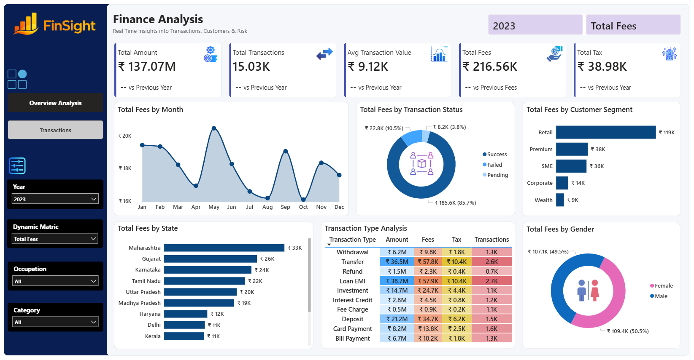
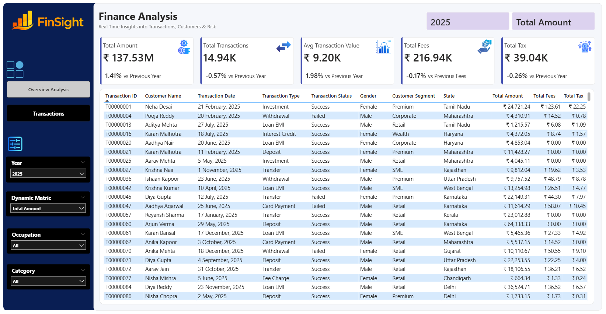

# finance-analysis-dashboard-powerbi 📊

> **An interactive Power BI dashboard for analyzing financial transactions, customer behavior, revenue, fees,
>  taxes, and business performance.**
> Built to help stakeholders monitor KPIs, identify trends, and make data-driven decisions through dynamic
>  visualizations and filters.

---

## 📌 Project Overview

The **Finance Analysis Dashboard** is an end-to-end Power BI project designed to analyze financial transaction data 
across multiple dimensions such as:

* 💰 Total Amount
* 💰 Total Transaction
* 📈 Avg Transaction Value
* 💵 Total Fees
* 💵 Total Taxes
* 💰 Total Fees by Month
* 💳 Total Fees by Transaction Status
* 👥 Total Fees by Customer Segments
* 🌍 Total Fees by State
* 💳 Transaction Types Analysis
* 👥 Total Fees by Gender
* 🚻 Gender Distribution
* ✅ Transaction Status

The dashboard provides an interactive experience where users can filter data 
by **Year**, **Occupation**, **Category**, and **Dynamic Metrics** to gain meaningful business insights.

---

# 📷 Dashboard Preview

## Overview Analysis




---

## Transactions Page




---

# 🚀 Features

### 📌 Executive KPI Cards

Displays key business metrics including:

* Total Transaction Amount
* Total Transactions
* Average Transaction Value
* Total Fees
* Total Tax
* Year-over-Year (YoY) Growth

---

### 📈 Monthly Trend Analysis

Visualizes monthly fee collection trends to identify:

* Peak transaction months
* Seasonal patterns
* Revenue fluctuations

---

### 🌍 State-wise Analysis

Compares fee collection across different states to identify:

* Highest contributing states
* Lowest performing regions
* Regional business opportunities

---

### 👥 Customer Segment Analysis

Breakdown of fees generated from customer segments:

* Retail
* Premium
* SME
* Corporate
* Wealth

---

### 💳 Transaction Status

Distribution of transactions by:

* Success
* Failed
* Pending

Useful for monitoring operational efficiency.

---

### 🚻 Gender Analysis

Compares total fees collected from:

* Male Customers
* Female Customers

---

### 💰 Transaction Type Analysis

Detailed breakdown of:

* Amount
* Fees
* Tax
* Total Transactions

Across transaction types:

* Withdrawal
* Deposit
* Transfer
* Loan EMI
* Card Payment
* Refund
* Bill Payment
* Investment
* Interest Credit
* Fee Charge

---

### 📋 Transaction Details Page

Provides complete transaction-level information including:

* Transaction ID
* Customer Name
* Transaction Date
* Transaction Type
* Status
* Gender
* Customer Segment
* State
* Amount
* Fees
* Tax

Perfect for detailed analysis.

---

# 🎯 Business Objectives

The dashboard helps answer questions such as:

* Which customer segment generates the highest revenue?
* Which states contribute the most fees?
* How are fees changing month-over-month?
* Which transaction types generate the highest fees?
* How many transactions are successful versus failed?
* What is the average transaction value?
* Which year performed better?
* Which occupations contribute the highest transaction volume?

---

# 📊 Key KPIs

| KPI                       | Description                     |
| ------------------------- | ------------------------------- |
| Total Amount              | Total value of all transactions |
| Total Transactions        | Total number of transactions    |
| Average Transaction Value | Average amount per transaction  |
| Total Fees                | Total fee collected             |
| Total Tax                 | Total tax collected             |
| YoY Growth                | Comparison with previous year   |

---

# 🎛 Interactive Filters

Users can dynamically filter dashboard data using:

* 📅 Year
* 📊 Dynamic Metric
* 👨‍💼 Occupation
* 📂 Category

---

# 🛠 Tools & Technologies

| Tool                | Purpose                        |
| ------------------- | ------------------------------ |
| Power BI Desktop    | Dashboard Development          |
| Power Query         | Data Cleaning & Transformation |
| DAX                 | Calculated Measures & KPIs     |
| Excel / CSV         | Data Source                    |
| Data Modeling       | Relationships                  |
| Interactive Visuals | Reporting                      |

---

# 📈 Power BI Skills Demonstrated

* Data Cleaning
* Data Transformation
* Data Modeling
* Star Schema
* DAX Measures
* Time Intelligence
* KPI Design
* Drill-through
* Dynamic Filtering
* Slicers
* Conditional Formatting
* Interactive Dashboard Design

---

# 📊 Dashboard Pages

## 1️⃣ Overview Analysis

Highlights:

* Executive KPIs
* Monthly Fee Trend
* Transaction Status
* Customer Segment
* State-wise Analysis
* Gender Distribution
* Transaction Type Matrix

---

## 2️⃣ Transactions

Includes:

* Detailed transaction records
* Dynamic filters
* Customer information
* Financial metrics
* Searchable data table

---

# 📈 Insights Generated

### Customer Insights

* Retail customers contribute the highest fees.
* Premium customers are the second-largest contributors.
* Wealth customers generate the lowest fee contribution.

### Geographic Insights

* Maharashtra records the highest fee collection.
* Gujarat and Karnataka are among the top-performing states.
* Delhi and Kerala show comparatively lower fee contributions.

### Operational Insights

* More than **85%** of transactions are successful.
* Failed and pending transactions represent a small proportion.

### Financial Insights

* Transaction amounts exceed **₹137 Million**.
* Total fees collected are approximately **₹217 Thousand**.
* Average transaction value is around **₹9K**.

### Business Insights

* Deposits, transfers, and withdrawals account for a significant share of transaction volume.
* Fee and tax contributions vary by transaction type, helping identify profitable services.

---

# 📂 Project Structure

```text
finance-analysis-dashboard-powerbi/
│
├── dashboard/
│   └── Finance Analysis Dashboard.pbix
├── Data/
│   ├── customers.csv
│   └── finance_transactions.csv
├── icons/
│   ├── Logo.png
│   ├── filter.png
│   ├── gross(3)png
│   ├── histogram.png
│   ├── menu(3).png
│   ├── taxes.png
│   ├── toilet.png
│   ├── transaction.png
│   ├── verified.png
│   └─── wage.png
├── images/
│   ├── Overview Dashboard.png
│   └── Transactions Dashboard.png
├── README.md
├── .gitignore
└── Business Requirements.docx
```

---

# ⭐ Future Enhancements

* Forecasting using Power BI Analytics
* Customer Churn Analysis
* Fraud Detection Dashboard
* Profitability Dashboard
* Mobile-Optimized Report
* Row-Level Security (RLS)
* Drill-through Reports
* AI-powered Insights

---

# 📚 Learning Outcomes

This project demonstrates proficiency in:

* Power BI Development
* Business Intelligence
* Financial Data Analysis
* Data Visualization
* Dashboard Design
* KPI Reporting
* Interactive Reporting
* Data Storytelling
* DAX Calculations
* Business Analytics

---

# 👨‍💻 Author

**Chandra Bhusan Singh**  
Data Analyst  
📧 Email: sbchandra1997@gmail.com  
🔗 [LinkedIn](https://www.linkedin.com/in/contactchandrabhusansingh/)  
🔗 [GitHub](https://github.com/chandraInsightsLab)


---

